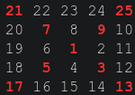
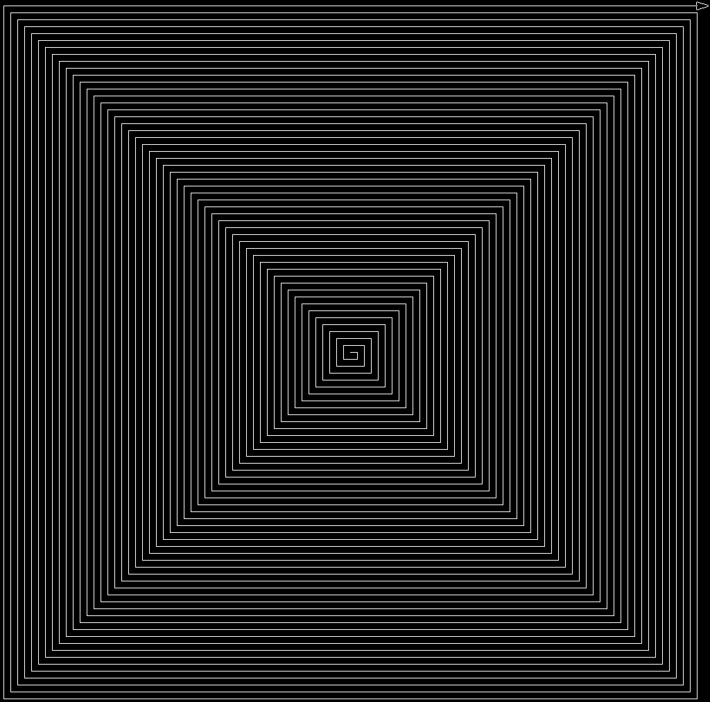

## [Problem 28](https://projecteuler.net/problem=28)

Language: UCBLogo 5.6

If anyone is familiar with 'turtle' programming, this is sort of like that. The manual [here](https://people.eecs.berkeley.edu/~bh/usermanual) was very helpful.

The problem is to find sum of the numbers highlighted red here:

but on a matrix sized 1001 rows instead of 5...

As this is solving the problem, it generates a (much less visible, since the problem asks for 1001 rows) spiral, like this one (screenshot is of 100 rows):

##### Requires

- [`logo`](https://people.eecs.berkeley.edu/~bh/logo.html)
